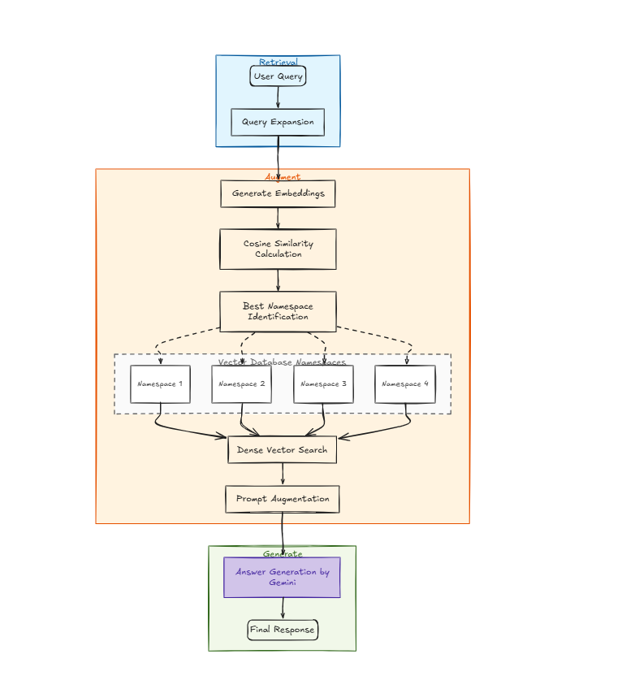
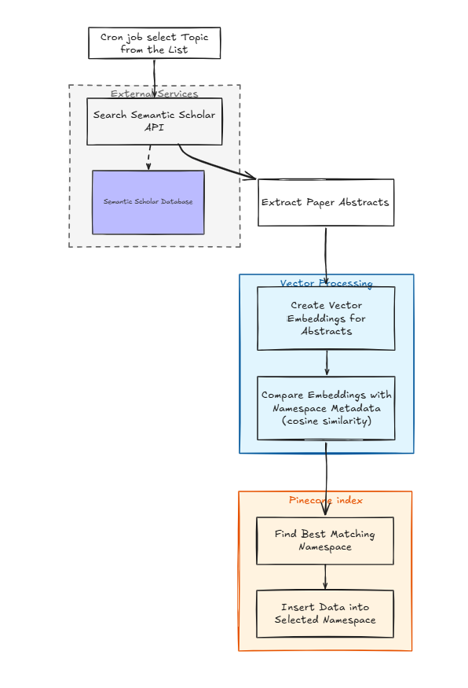

# Fitquery
## A RAG-based tool that delivers research-backed answers to fitness and diet queries from relevant academic papers and textbooks.

False information and misguidance have long been prevalent in the fitness world, a problem further amplified by the rise of social media. For anyone seeking guidance on exercise science, supplementation, or recovery, the quality of information they receive can have a direct impact on their results and wellbeing.
The most reliable information in these domains comes from research papers published in journals and academic textbooks — findings rigorously validated through controlled experimentation by domain experts.
It is very important that one receives correct information or advice for their questions on exercise science , supplementation and recovery. The most precise information can be found in research papers from renowned journals and textbooks. These findings are mostly backed up by rigorous experimentation with various subjects by experts in their respective fields . FitQuery can find answers for your seemingly simple questions from relevant research papers / textbooks.

## Architecture

### 1.Rag Pipeline  
   

  #### Retrieval
  In this phase, the user's query is expanded using the Gemini API by adding relevant keywords and context.  
  This helps reduce ambiguity while ensuring the query remains focused and does not drift away from the original intent.

  #### Augmentation
  Embedding vectors are generated for both the original and expanded queries.  
  These embeddings are compared against namespace representations (derived from their associated keywords) using cosine similarity to identify the most relevant namespaces.

  Once the best-matching namespaces are identified, the expanded query embedding is used to perform semantic search on the Pinecone index.  
  This retrieves the most relevant research paper abstracts corresponding to the user's query.

  #### Generation
  The retrieved abstracts are provided as context to a Gemini model, which generates a final, coherent answer to the user's query.
  
### 2. Data Ingestion Pipeline  
   

Data ingestion is handled manually by inserting new data into the appropriate namespaces from a predefined source.

Research papers are fetched using the Semantic Scholar API based on specific topics. Each paper undergoes preprocessing, where the title and authors are appended to the abstract to form a single unit referred to as a *chunk*.

An embedding is generated for each chunk. This embedding is then compared against namespace representations (derived from their associated keywords) using cosine similarity to determine the most relevant namespace.

Once the best-matching namespace is identified, the chunk and its embedding are inserted into the vector database.

## Folder structure

```bash
FitQuery/
├── client/
│   ├── src/
│   │   ├── app/
│   │   │   ├── (routes)/
│   │   │   │   └── home/
│   │   │   │       └── page.tsx
│   │   │   ├── components/
│   │   │   │   ├── BackgroundImage.tsx
│   │   │   │   ├── InputWithButton.tsx
│   │   │   │   ├── MainComponent.tsx
│   │   │   │   └── OutputComponent.tsx
│   │   │   ├── layout.tsx
│   │   │   └── page.tsx
│   │   ├── components/
│   │   │   └── ui/
│   │   │       ├── button.tsx
│   │   │       ├── input.tsx
│   │   │       └── sonner.tsx
│   │   ├── lib/
│   │   │   ├── axios.ts
│   │   │   ├── utils.ts
│   │   │   └── zodUtils.ts
│   │   └── Types/
│   │       └── types.ts
│
└── server/
    ├── src/
    │   ├── Controllers/
    │   │   ├── homeController.ts
    │   │   ├── migrationController.ts
    │   │   └── sparseEmbeddingsController.ts
    │   ├── Models/
    │   │   ├── NamespaceModel.js
    │   │   └── PineCone.js
    │   ├── Routes/
    │   │   ├── homeRoute.ts
    │   │   ├── migrateRoute.ts
    │   │   └── sparseEmbeddingsRoute.ts
    │   ├── Services/
    │   │   ├── createEmbeddigService.ts
    │   │   ├── dataIngestion.ts
    │   │   ├── insertionService.ts
    │   │   ├── queryExpansion.ts
    │   │   ├── queryService.ts
    │   │   ├── questionAnsweringService.ts
    │   │   └── sparseRetrival.ts
    │   ├── api/
    │   │   └── SemanticScholar.ts
    │   ├── data/
    │   │   └── namespace_embeddings.json
    │   ├── utility/
    │   │   ├── cosinesimilarity.ts
    │   │   ├── identifynamespace.ts
    │   │   └── namespaceembeddings.ts
    │   ├── index.ts
    │   └── server.ts
```
## Backend (`server/`)

The `server/` folder contains all backend logic for the application.

#### Controllers
Handle incoming HTTP requests, process input, and delegate business logic to services.
- `homeController.ts` – Handles user queries
- `migrationController.ts` – Manages migrations when embedding models change
- `sparseEmbeddingsController.ts` – Generates sparse vectors for namespaces

#### Services
Encapsulate the core business logic of the application, including query processing, embedding generation, and retrieval.

#### Utility
Contains helper functions used across services.
- `cosinesimilarity.ts` – Computes similarity between vectors using cosine similarity
- `namespaceembeddings.ts` – Stores predefined keywords for each namespace
- `identifynamespace.ts` – Matches user query keywords with namespaces to determine the most relevant ones

#### Models
Defines database and vector storage structures.
- `NamespaceModel.js` – Mongoose model storing namespace name, associated keywords, and vectors

#### API
- `SemanticScholar.ts` – Integrates with the Semantic Scholar API to fetch research paper abstracts

### Frontend (`client/`)

The `client/` folder contains the frontend application.

- Built using Next.js  
- Uses shadcn/ui for UI components  
- Uses Zod for schema validation and type safety  

## Challenges Faced and Future Work

One major challenge was a breaking change in the Gemini embedding API.  
The embedding model `google/gemini-embedding-001` was deprecated and replaced with `gemini-embedding-001`, which caused the application to stop functioning as expected.

To address this, a migration pipeline was implemented to transfer all existing data from the old index to a new index. This ensures that future model or schema changes can be handled more seamlessly.

Another challenge was the lack of a comprehensive source covering all fitness-related queries for a general audience. Identifying relevant topics required significant domain understanding. Additionally, many abstracts retrieved from the Semantic Scholar API were empty due to access and privacy restrictions.

### Future Work

- Expand data sources by incorporating fitness and diet textbooks alongside research papers  
- Improve data quality by filtering or enriching incomplete abstracts  
- Increase ingestion frequency by running cron jobs more frequently (e.g., hourly updates)  
